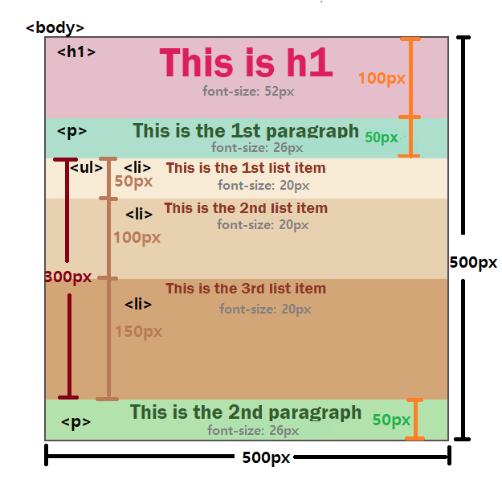

# CSS Units Change
Change the Absolute Units to Relative Units!

## What you will be doing

The reference layout (see below) is solely designed with `px`. In this exercise, we will change the length units of each element by using `em`, `rem`, `vw`, `vh`, and `%`.

### Have a look at the width, height, and font size of elements:

## Tasks

Now let's convert all the `px`s into relative units. Please note, sizes should remain the same as the reference image.

### Initial Setup 
By default, base font size is set to __16px__. Please change it to __10px__ before getting into the tasks below.

### Task 1
Give `html` __100%__ of view width and view height by using `vw` and `vh`

### Task 2
Change the units of `body`: 
- use `rem` for height and width

### Task 3
Change the units of `h1`:
- use `rem` for height and font-size 

### Task 4
Change the units of `p`:
- use `%` for height
- use `rem` for font-size
  
### Task 5
Change the units of `ul` and `li`:
-  use `rem` for the height of `ul`
-  use `em` for the height and font-size of `li`
  
## Hints
- [MDN Docs](https://developer.mozilla.org/en-US/docs/Learn/CSS/Building_blocks/Values_and_units)
- [Useful Website](https://elementor.com/help/whats-the-difference-between-px-em-rem-vw-and-vh/)
